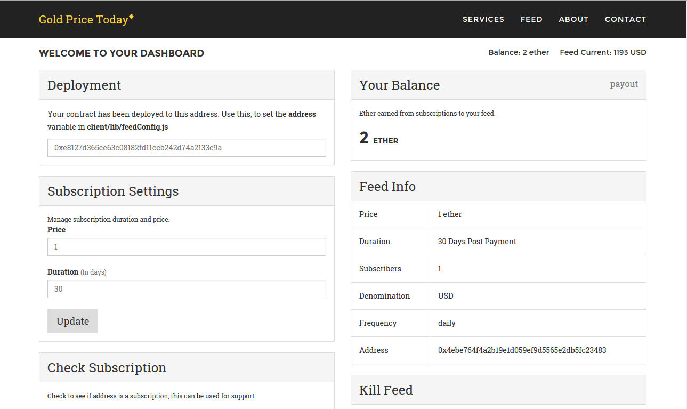

# meteor-dapp-pricefeed
A MeteorJS price feed DApp - for operating price feeds on Ethereum.

** Please note that this DApp is still in Alpha (still working out the bugs).

##  Installation

1. Clone this repo

  `git clone http://github.com/SilentCicero/meteor-dapp-pricefeed.git`

##  Deployment

Start an eth node open the http://localhost:3000 in *mist*, *mix* or *alethzero* or run a CPP node as follows:

    $ eth -j -b // for a mining node: $ eth -j -b -f -n no -m yes

Start your app using meteor

    $ cd meteor-dapp-pricefeed/app
    $ meteor

Go to http://localhost:3000/admin

  - click `'Deploy PriceFeed Contract'` and copy the new address

Edit client/lib/feedConfig.js

  - change `Feed.address` to the new address

Wait for mining, refresh, enjoy!

##  Server Deployment

Edit server.py

  - change vars `CONTRACT_ADDRESS` and `OWNER_ADDRESS` to the appropriate values

Running the server

    $ cd meteor-dapp-pricefeed/app
    $ python server.py

##  DApp Functionality
- landing page
- admin page (a dashboard for contract owner)
- tracking page (to track subscriptions)
- can subscribe an address
- only subscribers can access the feed data
- renewable subscriptions
- owner can manage feed price, subscribers, subscription duration and payout balance
- a basic python server for updating the feed info

##  Page Layout
- Landing page: /
- Admin page: /admin
- Tracking page: /track/0x00000

##  About

This DApp is a starting point for deploying and operating price feeds on Ethereum. It could potentially be modified to meet the needs of almost any price feed. Presently, the default title is "Gold Price Today*" (which will be my gold price feed).

<a href="https://github.com/ethereum/dapp-bin/blob/master/pricefeed/pricefeed.sol">Original SOL</a> by Gavin Wood

##  TODO
- Decimal number support for feed info
- Multi-type feed data (e.g. "gold", "silver" etc.)
- Better error handling
- Trigger event on info update
- Setup contact form (make active)
